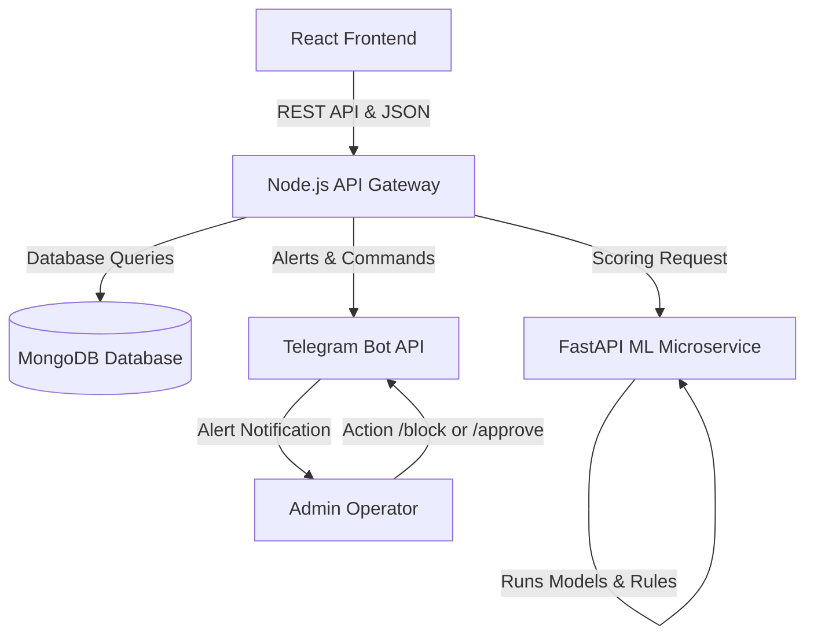

# FraudShield AI - Credit Card Fraud Detection System

FraudShield AI is a production-grade, real-time credit card fraud detection system combining modern machine learning (Random Forest & XGBoost) with a rule-based override engine, behavioral telemetry analysis, device fingerprinting, and Telegram alerting. All incidents are logged in MongoDB and managed via a high-fidelity dark fintech dashboard.

---

## System Architecture

The application has four primary modules:
1. **Frontend (`/frontend`)**: A React + Vite SPA using Tailwind CSS v3 and Recharts for interactive analytics, transaction tracking, rule configuration, and real-time payment simulations.
2. **Backend (`/backend`)**: A Node.js + Express API Gateway hosting JWT auth, rate limiting, Mongoose database models, geo-distance velocity checks, and a Telegram alert dispatcher.
3. **ML Microservice (`/ml-service`)**: A FastAPI app hosting model inference (`/predict`), training endpoints (`/train`), and explainable AI weights.
4. **Telegram Bot Webhook**: Integrates with security operators, delivering rich markdown messages with inline buttons (`Approve` / `Block`) to trigger actions directly from mobile devices.



---

## Key Features

- **JWT Authentication**: Secure role-based routing protecting system statistics and policy rules.
- **Explainable AI (XAI)**: High-resolution breakdown showing exactly *why* a transaction was flagged, comparing individual feature contribution weights in real-time.
- **Behavioral Telemetry**: Tracks velocity (number of transaction attempts in the last hour), geolocation coordinates (Haversine distance from home base), and decline history.
- **Device Intelligence**: Client-side canvas/User Agent harvesting to assign device hashes and identify account-takeover device swapping anomalies.
- **Dual Resilient Fallback**: 
  - If **MongoDB is offline**, the backend automatically loads a pre-seeded `mock_transactions_seed.json` array in memory, keeping all dashboard pages and simulation forms fully interactive.
  - If the **ML Service is offline**, the backend evaluates metrics using a local deterministic rules framework, preventing payments checkout blocks.

---

## Quick Start (Local Setup)

Ensure you have **Node.js v18+** and **Python 3.10+** installed.

### 1. Database Setup
Start your local MongoDB instance. If you have MongoDB running locally, the backend will auto-connect to `mongodb://127.0.0.1:27017/fraud_detection`.
*(Note: If you do not have MongoDB running, the application will automatically start in **In-Memory Mock Fallback Mode** with 100 preloaded transaction history metrics, allowing full testing immediately.)*

### 2. Environment Configurations
Rename `.env.example` to `.env` in both the root folder and the `/backend` folder. Adjust settings as needed:
```env
PORT=5000
MONGO_URI=mongodb://127.0.0.1:27017/fraud_detection
JWT_SECRET=super_secret_fraud_shield_key
ML_SERVICE_URL=http://127.0.0.1:8000/predict
```

### 3. Initialize the ML Microservice
Create a Python virtual environment, install requirements, and start the FastAPI uvicorn server:
```bash
cd ml-service
python -m venv venv
# On Windows:
.\venv\Scripts\activate
# On Mac/Linux:
source venv/bin/activate

pip install -r requirements.txt
python scripts/generate_dataset.py
python scripts/train.py
python -m uvicorn app.main:app --host 0.0.0.0 --port 8000
```
This will generate `data/transactions.csv`, balance classes using **SMOTE**, train both **Random Forest** & **XGBoost** models, score the champion, and save it to `models/fraud_model.joblib`.

### 4. Start the Express Backend
Install packages, run the DB seeder (optional), and boot the server:
```bash
cd backend
npm install
npm run seed  # Pre-populates MongoDB/Mock JSON with 100 historical transactions
npm run dev
```

### 5. Start the React Frontend
```bash
cd frontend
npm install
npm run dev
```
Open **`http://localhost:5173`** in your browser. 
Log in using:
- **Username**: `admin`
- **Password**: `admin123`

---

## Docker Compose (Production Deployment)

To build and run all containers (MongoDB, FastAPI, Node Gateway, Nginx Frontend) in one command:
```bash
docker-compose up --build
```
- Frontend will be served at `http://localhost:3000`
- Express API Gateway at `http://localhost:5000`
- ML Service API at `http://localhost:8000`
